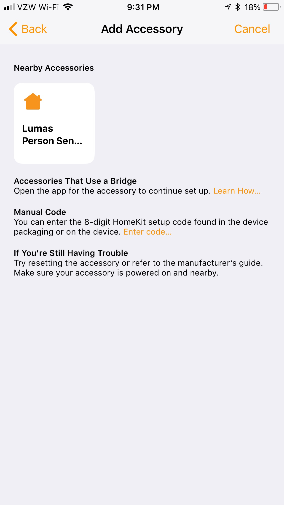

Lumas enables person detection and HomeKit support to off the shelf IP camera.


Currently it only support Amcrest IP cameras, but more camera support is coming.
Presently it also only supports one camera at a time.

## Setup

### Requirements

**Software Requirements:** 
* Docker (CE or EE)

**Hardware Requirements:**
* Architecture: x86_64

### Configuring Lumas

1) Copy the docker-compose.yml file from this repo to the machine where you want to run Lumas
2) In the same directory, create a file called config.yml. There's an example configuration file in this repo.

There are three sections to the configuration file
* global
* plugins
* cameras

The basic configuration file structure looks like this:
```
---
global:
  <global configuraiton parameters>
cameras:
  - name: "Camera Name"
    plugin:
      name: <camera plugin>
      config:
        <plugin parameters>
```

### Global parameters

In the global section, the following values are available:

* timezone - The timezone you're in. Full list [here](https://en.wikipedia.org/wiki/List_of_tz_database_time_zones). Default is "Europe/London"
* loglevel - Options are ['info','warn','error','debug']. Default is 'info'
* homekit_code - The HomeKit code to use

Example:
```
---
global:
  timezone: "America/Los_Angeles"
  loglevel: "info"
  homekit_code: "431-48-255"
```

### Cameras parameters

The `cameras` section of the configuration is a list of cameras. Currently
Lumas ony supports one camera at a time. Multi-camera support will be added
soon.

Also, currently only Amcrest cameras are support. ONVIF compliant camera support will be added soon.

Example:
```
---
cameras:
  - name: "<Camera Name>"
    plugin:
      name: amcrest
      config:
        address: "<CAMERA IP OR DNS ADDRESS>"
        username: "<CAMERA USERNAME>"
        password: "<CAMERA PASSWORD>"
```

### Logs

By default, the application creates a `logs` directory in the same directory as
the docker-compose.yml file. You can change the location of the logs by
modifying the mount point in the docker-compose.yml file. This is recommended
as the logs are not rotated and so they'll fill up over time.

### Running

Run the application with `docker-compose up -d`

### Setting up HomeKit

#### 1) Open the Home app on iOS.

#### 2) Click the '+' symbol and select "Add Accessory"


#### 3) On the 'Add Accessory' page, select "Don't have a code or Can't scan?"


#### 4) In the Nearby Accessories section, select "Lumas Camera"


#### 5) Repeat steps 1-3. In the Nearby Accessories section, select "Lumas Person Sensor"


That's it! You now have a motion sensor that only triggers motion when a person is detected in the camera feed! HomeKit will send you snapshots of the detected person(s) in a notification.


## Roadmap

* Multi-camera support
* More camera support, including any ONVIF compatible camera
* Face recognition - Learn familiar faces over time with custom alerts
* Time lapse - See what's been happening through the day
